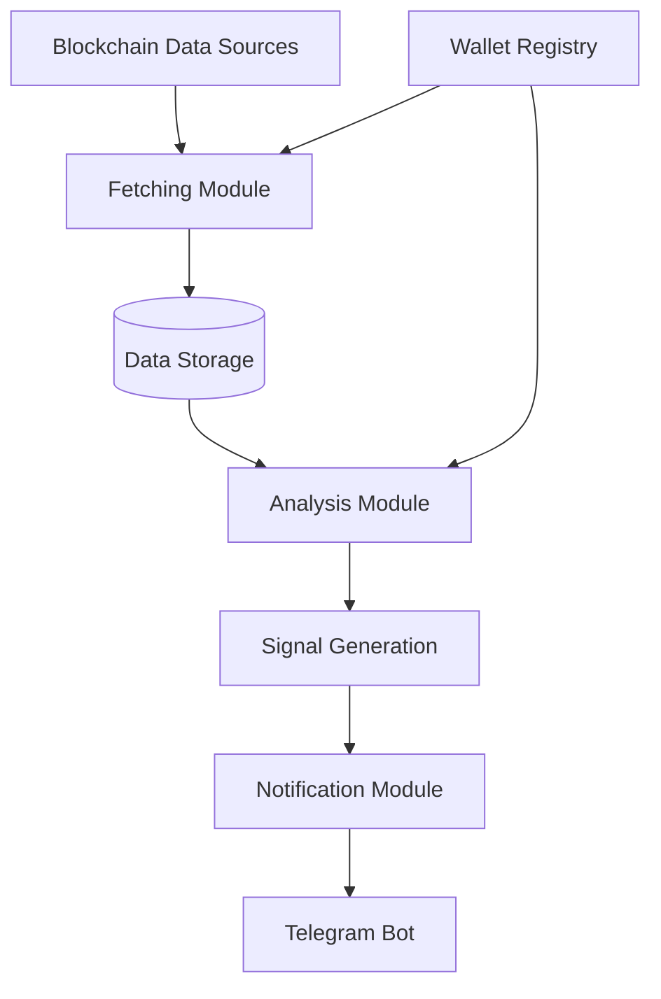

# System Patterns

## System Architecture
The system follows a modular, event-driven architecture with these key components:

## Core Components
1. **Fetching Module**
   - Connects to blockchain nodes/APIs
   - Monitors specified wallets for new transactions
   - Processes and normalizes transaction data

2. **Analysis Module**
   - Categorizes transactions (DEX, CEX, staking, etc.)
   - Identifies significant movements based on amount and destination
   - Detects patterns across multiple wallets

3. **Signal Generation**
   - Applies rule-based logic to analyzed data
   - Generates trading signals with confidence levels
   - Filters signals to reduce noise

4. **Notification Module**
   - Formats alerts with relevant context
   - Manages delivery to Telegram
   - Handles delivery confirmation and retries

## Data Flow
1. Transaction data ingested from blockchains
2. Filtered by wallet registry and transaction criteria
3. Enriched with context (transaction type, historical patterns)
4. Processed through signal generation rules
5. Formatted as user-friendly notifications
6. Delivered to end-users via Telegram

## Design Patterns
- **Observer Pattern**: For monitoring blockchain events
- **Strategy Pattern**: For different analysis algorithms
- **Factory Pattern**: For creating different types of alerts
- **Repository Pattern**: For data access abstraction
