<div align="center">
  
</div>

## Why SentryCage exists

SentryCage wasn't designed on a whiteboard. It started the way most useful tools do: from frustration.

Its author traded for years and kept losing money not to bad strategies, but to blindness — manipulation, engineered moves, dumps that "came out of nowhere". Until you looked back and realized big capital had repositioned hours earlier, and everyone else was just reacting to the chart afterwards. That's what losing to an information gap looks like.

Then came the realization that changed everything: **on a public blockchain, big money can't move in secret.** Every whale transfer leaves a permanent, public footprint. The information isn't hidden — most people simply never look where it actually lives: the chain itself, not the chart.

SentryCage is that idea turned into software. It watches whale wallets on Ethereum and 60+ EVM chains, reasons over what each move means, and alerts your Telegram — giving you back the leap on large capital movements, *before* they transform into the price trend.

*Self-hosted whale tracker for EVM chains. Runs on your machine. Alerts on your Telegram.*

No cloud. No subscription. No account. Your API keys never leave your machine.

---

## 🎉 100% free and open source

The blockchain was born free and open — a public ledger anyone can read, verify, and build on. SentryCage does nothing more than read that same ledger. So the question wrote itself: *why would a tool like this ever be paid?* We couldn't find a good answer. So it isn't.

**What this means concretely:**
- Every feature unlocked — multi-chain tracking, all six signals, AI reasoning, unlimited history
- No license server, no license key, nothing to activate
- The code is here to read, run, fork, and improve
- Licensed under MIT (see [LICENSE](LICENSE)) — free to use, modify, and fork, forever

A tool like this also gets better with more eyes on it: more chains, more signal ideas, more edge cases caught, more people keeping each other honest about what's actually happening on-chain.

---

## What's live today

Everything you need to run it is here and working:

- [x] Whale tracking on Ethereum + 60+ EVM chains
- [x] Six on-chain signals: accumulation, distribution, CEX deposit/withdrawal, large transfer, unusual activity
- [x] AI reasoning with live market context (Ollama local / Claude / OpenAI)
- [x] Telegram alerts, local SQLite storage
- [x] 75/75 automated tests passing

---

## What you get

```
Whale deposits 500 ETH to Binance at 14:32

Your Telegram at 14:32:

  🔴 DISTRIBUTION — HIGH CONFIDENCE
  Wallet: 0x28c6...1d60 (Binance Hot)
  Chain: Ethereum
  Value: 500 ETH

  AI Reasoning:
  1. This wallet usually moves to exchanges right before it sells
  2. Correlated with 2 other whale deposits in the last 30 min
  3. Pattern matches behavior seen before the March drawdown

  Predicted impact: BEARISH
  What to watch: follow-up deposits from linked wallets
```

---

## 🤝 We want your help — here's how to contribute

SentryCage is community-driven from now on. You don't need to be a blockchain expert to help — there's room for all kinds of contributions:

| Area | Examples |
|---|---|
| **New chains** | Add support for an EVM chain we don't cover yet |
| **New signals** | Got an idea for a pattern worth detecting? Propose it |
| **AI reasoning** | Improve prompts, add a new LLM provider, tune the fallback logic |
| **Bug fixes** | Found something broken? Open an issue or send a PR |
| **Tests** | We're at 75/75 — help us keep it that way as the code grows |
| **Docs** | Clearer setup steps, translations, troubleshooting tips |

See [CONTRIBUTING.md](CONTRIBUTING.md) for how to set up a dev environment, coding conventions, and how to open a good pull request.

Not a developer? You can still help: open issues for bugs, share feedback on signal quality, or just spread the word if SentryCage is useful to you.

**Questions or ideas before writing code?** Open a [GitHub Discussion](https://github.com/SentryCage/sentrycage/discussions) or an issue — happy to talk it through first.

---

## Prerequisites

Before you start, get these ready:

| What | Where | Notes |
|---|---|---|
| **Etherscan V2 API key** | [etherscan.io/apis](https://etherscan.io/apis) | One key covers all 60+ chains |
| **Telegram bot token** | [@BotFather](https://t.me/botfather) | `/newbot` → copy the token |
| **Your Telegram chat ID** | [@userinfobot](https://t.me/userinfobot) | Send it `/start` |
| **Docker + Docker Compose** | [docs.docker.com](https://docs.docker.com/get-docker/) | For the recommended setup |

Optional (for AI reasoning):
- **Ollama** running locally with `llama3.1:8b` pulled — or an OpenAI/Claude API key

---

## Setup — Docker (recommended)

Works on Windows, macOS, Linux. Setup time: ~10 minutes.

**1. Clone and configure**

```bash
git clone https://github.com/SentryCage/sentrycage.git
cd sentrycage
cp .env.example .env
```

**2. Fill in `.env`**

Open `.env` and set at minimum:

```env
# Required
ETHERSCAN_API_KEY=your_key_here
TELEGRAM_BOT_TOKEN=123456789:ABCdef...
TELEGRAM_CHAT_ID=987654321

# Optional — for AI reasoning
LLM_PROVIDER=ollama
OLLAMA_BASE_URL=http://host.docker.internal:11434
```

Full `.env` reference: [Configuration](#configuration)

**3. Start**

```bash
docker compose up -d
```

**4. Verify it's running**

```bash
docker compose logs -f sentrycage
```

You should see:
```
INFO  Database initialized: data/whale_tracker.db
INFO  TelegramNotifier connected as @YourBot
INFO  SentryCage is running
```

Within a few minutes, you'll receive a startup message on Telegram.

---

## Setup — Manual (no Docker)

For VPS without Docker, or Termux on Android.

**Requirements:** Python 3.9+ (tested on 3.12)

```bash
git clone https://github.com/SentryCage/sentrycage.git
cd sentrycage

python -m venv venv
source venv/bin/activate          # Windows: venv\Scripts\activate

pip install -r requirements.txt

cp .env.example .env
# edit .env with your keys

python main.py
```

---

## Setup — Termux (Android)

SentryCage runs on Android via [Termux](https://termux.dev).

```bash
pkg update && pkg upgrade
pkg install python git

git clone https://github.com/SentryCage/sentrycage.git
cd sentrycage

pip install -r requirements.txt

cp .env.example .env
nano .env   # fill in your keys

python main.py
```

> Note: Ollama is not available on Android — AI reasoning will fall back to rule-based signals automatically.

---

## Configuration

Full reference for `.env`:

```env
# ── Required ──────────────────────────────────────────────
ETHERSCAN_API_KEY=           # from etherscan.io/apis
TELEGRAM_BOT_TOKEN=          # from @BotFather
TELEGRAM_CHAT_ID=            # your chat ID from @userinfobot

# ── Chains & polling ─────────────────────────────────────
POLLING_INTERVAL=60          # seconds between scans

# ── AI Reasoning (optional) ──────────────────────────────
LLM_PROVIDER=ollama          # ollama | claude | openai | lmstudio
ENABLE_REASONING=true

OLLAMA_BASE_URL=http://localhost:11434
# ANTHROPIC_API_KEY=         # if LLM_PROVIDER=claude
# OPENAI_API_KEY=            # if LLM_PROVIDER=openai

# ── Storage ──────────────────────────────────────────────
DB_PATH=./data/whale_tracker.db
```

---

## Adding wallets to track

Edit `src/config/wallet_registry.py`:

```python
ALL_WALLETS = [
    WalletInfo(
        address="0x28c6c06298d514db089934071355e5743bf21d60",
        label="Binance Hot Wallet",
        chains=[Chain.ETHEREUM],
        alert_threshold_eth=50.0,
    ),
    WalletInfo(
        address="0xYourWalletHere",
        label="My whale",
        chains=[Chain.ETHEREUM, Chain.ARBITRUM],
        alert_threshold_eth=10.0,
    ),
]
```

Restart after editing:
```bash
docker compose restart sentrycage
```

---

## Signal types

| Signal | Meaning |
|---|---|
| **Accumulation** | A whale is building up its position |
| **Distribution** | A whale is unloading its position |
| **CEX Deposit** | Coins moving to an exchange — often before a sell |
| **CEX Withdrawal** | Coins leaving an exchange — often before accumulating |
| **Large Transfer** | A high-value move between wallets |
| **Unusual Activity** | A wallet breaking its usual pattern |

---

## Roadmap

What we're building next — and where contributions are especially welcome:

- **Smart Money Following** — one alert when several tracked whales move the same way at once
- **Sharper price awareness** — the AI already reads live market context; next it weighs every signal against price so you can separate a real threat from noise
- **Backtesting** — see how a signal has performed historically before you act on it
- **More chains, more signals** — this list grows with the community; open an issue to propose one

---

## Hardware & requirements

SentryCage runs light. The tracker needs almost nothing; the only heavy part —
**local AI reasoning** — is optional, and if your machine can't handle it the app
keeps working anyway.

| What | Needs |
|---|---|
| Whale tracker (core) | ~256 MB RAM, any CPU, a network connection |
| Telegram alerts | Network only |
| AI reasoning via **Ollama** (local) | 8–16 GB RAM, ideally a GPU |
| AI reasoning via **Claude / OpenAI** | Network + API key — nothing local |

**Built to degrade, not break.** Local model too heavy → it drops to rule-based
signals and you still get every alert. API rate-limited → it backs off and retries.
The only hard stops are no network or wrong Telegram credentials.

(And if a *test* fails on your machine, it's the environment, not the code — Python
version, a missing dependency, or no network. Run `pytest -v` and check
[Troubleshooting](#troubleshooting).)

---

## Troubleshooting

**No Telegram messages after startup**

Check the bot token and chat ID. Make sure you've started a conversation with your bot (`/start`) before running SentryCage.

```bash
docker compose logs sentrycage | grep -i telegram
```

**Ollama timeout / AI reasoning disabled**

AI reasoning is optional. Without it, SentryCage falls back to rule-based signals automatically. To fix:
```bash
ollama pull llama3.1:8b
# then verify:
curl http://localhost:11434/api/tags
```

---

## Running tests

```bash
# All tests
pytest

# With coverage
pytest --cov=src --cov-report=term-missing
```

Current: **75 / 75 tests passing** (full suite green).

> These tests check the software logic. They can't check *your machine*. If a
> run fails because of hardware or environment — not enough RAM for the local
> model, no network, a rate-limited API key — SentryCage degrades on purpose
> instead of crashing: AI reasoning falls back to rule-based signals. See
> [Troubleshooting](#troubleshooting) and [Hardware & requirements](#hardware--requirements).

---

## License

SentryCage is released under the **MIT License**: free to use, modify, fork and
self-host — for any purpose, commercial or not. Contributions are always welcome.
See [LICENSE](LICENSE) for the full text.

---

## Disclaimer

SentryCage is a monitoring and analysis tool. It does not execute trades on your behalf.

Cryptocurrency trading involves substantial risk of loss. The signals generated by this software are not financial advice. Past pattern detection does not guarantee future results. Use at your own risk.

---

## Support & Community

- **Issues & bugs:** [GitHub Issues](https://github.com/SentryCage/sentrycage/issues)
- **Ideas & questions:** [GitHub Discussions](https://github.com/SentryCage/sentrycage/discussions)
- **Want to contribute?** Start with [CONTRIBUTING.md](CONTRIBUTING.md)

SentryCage is and will always be free. If it saved you from a blind trade, you can offer me a coffee — it keeps the whale watching:

<a href="https://buymeacoffee.com/KevAlien"></a>

---

Built by [KevAlien](https://github.com/KevAlien) · [SentryCage](https://github.com/SentryCage) · now built with you.
